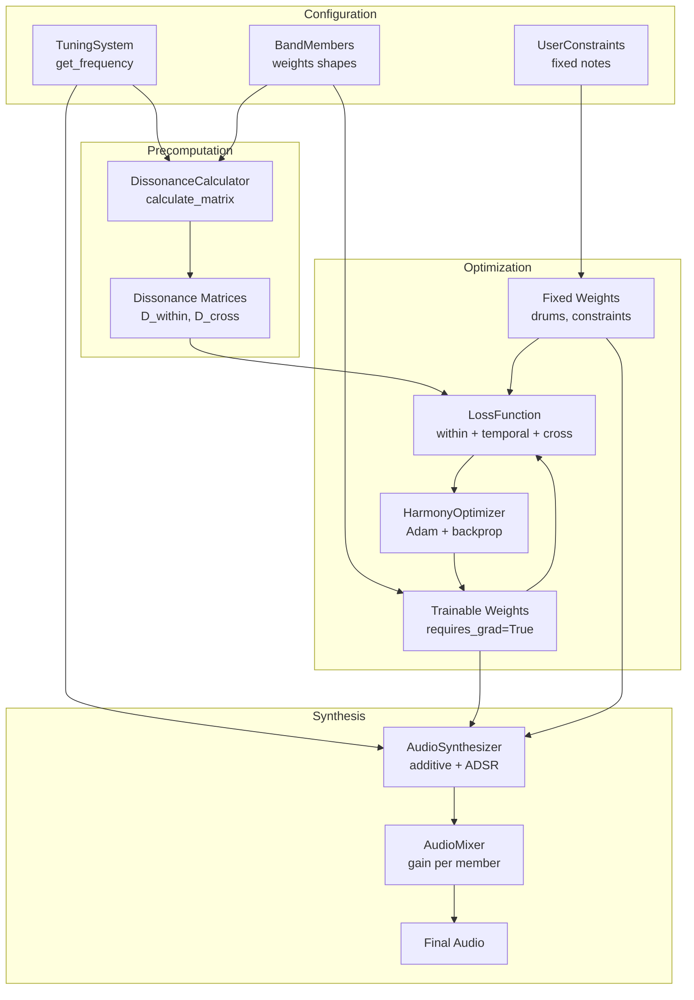

# Harmony From First Principles - Architecture Design

## Executive Summary

This document outlines the architecture for extending the current single-instrument harmony optimizer into a multi-member band system with support for alternate tuning systems, ADSR envelopes, user constraints, and a Gradio web interface.

## Core Design Principles

1. **Separation of Concerns**: Tuning, instruments, band members, and audio synthesis are independent modules
2. **Extensibility**: New tuning systems, instruments, and band member types can be added without modifying existing code
3. **PyTorch-Native**: All computations remain differentiable for gradient-based optimization
4. **Lazy Evaluation**: Dissonance matrices are computed once and cached
5. **Time-Aware**: Beat durations and time signatures are explicit, not hardcoded

---

## Class Architecture

### 1. Tuning Systems (`tuning/`)

```python
class TuningSystem(ABC):
    """Abstract base for all tuning systems."""
    
    @abstractmethod
    def get_frequency(self, key_index: int) -> float:
        """Get frequency in Hz for a given key index."""
        pass
    
    @property
    @abstractmethod
    def num_keys(self) -> int:
        """Number of discrete keys available."""
        pass
    
    @property
    @abstractmethod
    def key_names(self) -> List[str]:
        """Human-readable names for each key."""
        pass

class TwelveTET(TuningSystem):
    """Standard 12-tone equal temperament, MIDI-compatible."""
    
class PythagoreanTuning(TuningSystem):
    """Pythagorean tuning with wolf fifth."""
    
class MeantoneTuning(TuningSystem):
    """Quarter-comma or third-comma meantone."""
    
class EDOSystem(TuningSystem):
    """N-tone equal division of the octave (19-EDO, 31-EDO, etc.)."""
    
class NonOctaveSystem(TuningSystem):
    """Bohlen-Pierce, alpha, beta, gamma scales."""
```

**Key Design Decision**: Tuning systems expose discrete keys with continuous frequencies. This maintains the optimization constraint (discrete choices) while allowing arbitrary frequency mappings.

---

### 2. Instruments (`instruments/`)

```python
@dataclass
class Harmonic:
    """A single harmonic partial with frequency ratio and amplitude."""
    ratio: float          # Frequency relative to fundamental (e.g., 2.0 = octave)
    amplitude: float      # Relative amplitude (0.0 to 1.0)
    adsr: Optional[ADSR]  # Optional per-harmonic envelope

class ADSR:
    """Attack-Decay-Sustain-Release envelope."""
    attack: float         # seconds
    decay: float          # seconds  
    sustain_level: float  # 0.0 to 1.0
    release: float        # seconds
    
    def get_envelope(self, duration: float, sample_rate: int) -> torch.Tensor:
        """Generate envelope samples for a given duration."""

class Instrument(ABC):
    """Abstract base for instruments with harmonic profiles."""
    
    @abstractmethod
    def get_harmonics(self, fundamental_hz: float) -> List[Harmonic]:
        """Return harmonics for a given fundamental frequency."""
        pass
    
    def apply_adsr(self, audio: torch.Tensor, note_start: int, 
                   note_end: int, sample_rate: int) -> torch.Tensor:
        """Apply instrument envelope to audio segment."""

class Synthesizer(Instrument):
    """Default synth with 6 harmonics, instant on/off."""
    
class Guitar(Instrument):
    """Guitar-like with inharmonicity and pluck envelope."""
    
class Bass(Instrument):
    """Bass guitar with fewer harmonics and longer sustain."""
    
class Drum(Instrument):
    """Noise-based with very short envelope, no harmonics."""
```

**Key Design Decision**: Instruments define their harmonic content, which feeds into dissonance calculation. ADSR is applied during audio synthesis, not during optimization (to allow precomputed D matrices).

---

### 3. Band Members (`band/`)

```python
class BandMember(ABC):
    """Abstract base for all band members (optimizable or fixed)."""
    
    def __init__(self, name: str, instrument: Instrument, 
                 tuning: TuningSystem, num_beats: int):
        self.name = name
        self.instrument = instrument
        self.tuning = tuning
        self.num_beats = num_beats
    
    @abstractmethod
    def get_weights_shape(self) -> Tuple[int, int]:
        """Return (num_keys, num_beats) shape for this member."""
        pass
    
    @abstractmethod
    def is_trainable(self) -> bool:
        """Whether this member's weights are optimized."""
        pass
    
    @abstractmethod
    def prepare_weights(self, raw_weights: torch.Tensor) -> torch.Tensor:
        """Transform raw weights for playback (e.g., apply polyphonic constraints)."""
        pass

class PolyphonicMember(BandMember):
    """Piano-like: multiple notes per beat (chords allowed)."""
    
    def __init__(self, name: str, instrument: Instrument,
                 tuning: TuningSystem, num_beats: int,
                 key_range: Tuple[int, int] = (21, 108)):
        super().__init__(name, instrument, tuning, num_beats)
        self.key_range = key_range
    
    def get_weights_shape(self) -> Tuple[int, int]:
        return (self.key_range[1] - self.key_range[0], self.num_beats)
    
    def is_trainable(self) -> bool:
        return True
    
    def prepare_weights(self, raw_weights: torch.Tensor) -> torch.Tensor:
        """Apply ReLU and keep all positive weights (polyphonic)."""
        return torch.relu(raw_weights)

class MonophonicMember(BandMember):
    """Guitar/Bass-like: single strongest note per beat."""
    
    def __init__(self, name: str, instrument: Instrument,
                 tuning: TuningSystem, num_beats: int,
                 key_range: Tuple[int, int] = (40, 64)):
        super().__init__(name, instrument, tuning, num_beats)
        self.key_range = key_range
    
    def get_weights_shape(self) -> Tuple[int, int]:
        return (self.key_range[1] - self.key_range[0], self.num_beats)
    
    def is_trainable(self) -> bool:
        return True
    
    def prepare_weights(self, raw_weights: torch.Tensor) -> torch.Tensor:
        """Apply softmax to select single strongest note per beat."""
        # Gumbel-softmax for differentiability during training
        # Argmax for inference
        pass

class DrumMember(BandMember):
    """Drums: fixed pattern, not optimized."""
    
    def __init__(self, name: str, pattern: str = "basic_rock",
                 num_beats: int = 8):
        # Drums don't use tuning system - they trigger samples/patterns
        super().__init__(name, Drum(), TwelveTET(), num_beats)
        self.pattern = pattern
    
    def is_trainable(self) -> bool:
        return False
    
    def get_fixed_pattern(self) -> torch.Tensor:
        """Return fixed drum pattern (e.g., kick on 1,3; snare on 2,4)."""
        # Shape: (num_drum_sounds, num_beats)
        pass
```

**Key Design Decision**: Each member owns its own weight matrix shape and transformation. This allows different key ranges, beat counts, and polyphonic behaviors per member.

---

### 4. Dissonance Calculation (`dissonance/`)

```python
class DissonanceCalculator:
    """Computes dissonance matrices for arbitrary tuning systems."""
    
    def __init__(self, max_hz: float = 11025):
        self.max_hz = max_hz
    
    def calculate_matrix(self, 
                        tuning: TuningSystem,
                        instrument: Instrument,
                        key_range: Tuple[int, int]) -> torch.Tensor:
        """
        Compute D[i,j] = dissonance between key i and key j.
        
        Includes all harmonic interactions up to max_hz.
        """
        # Returns shape: (num_keys, num_keys)
        pass
    
    def calculate_cross_matrix(self,
                              tuning1: TuningSystem,
                              instrument1: Instrument,
                              key_range1: Tuple[int, int],
                              tuning2: TuningSystem,
                              instrument2: Instrument, 
                              key_range2: Tuple[int, int]) -> torch.Tensor:
        """
        Compute dissonance between two different members
        (different tunings, different instruments).
        """
        # Returns shape: (num_keys1, num_keys2)
        pass
```

**Key Design Decision**: The dissonance calculator operates on (frequency, amplitude) partials, making it completely independent of the tuning system. Cross-member dissonance handles different key counts and ranges.

---

### 5. Audio Synthesis (`synthesis/`)

```python
class AudioSynthesizer:
    """Generates audio from weights using additive synthesis."""
    
    def __init__(self, sample_rate: int = 22050):
        self.sample_rate = sample_rate
    
    def synthesize(self,
                   member: BandMember,
                   weights: torch.Tensor,
                   beat_duration: float,
                   total_duration: float) -> torch.Tensor:
        """
        Generate audio for a single band member.
        
        Args:
            weights: Prepared weights from member.prepare_weights()
            beat_duration: Duration of each beat in seconds
            total_duration: Total audio duration
        """
        # Returns shape: (num_samples,)
        pass

class AudioMixer:
    """Mixes multiple audio tracks with level control."""
    
    def __init__(self):
        self.levels = {}  # member_name -> gain
    
    def set_level(self, member_name: str, gain_db: float):
        """Set mix level for a member in decibels."""
        pass
    
    def mix(self, audio_tracks: Dict[str, torch.Tensor]) -> torch.Tensor:
        """Combine multiple tracks into single stereo output."""
        pass
```

**Key Design Decision**: Synthesis is separate from optimization. ADSR envelopes are applied during synthesis, not during loss calculation (where we use average amplitude).

---

### 6. Optimization (`optimization/`)

```python
class UserConstraint:
    """Fixed notes that influence dissonance but aren't optimized."""
    
    def __init__(self, member_name: str, 
                 fixed_weights: torch.Tensor,  # Non-zero where fixed
                 beat_indices: List[int]):     # Which beats this applies to
        self.member_name = member_name
        self.fixed_weights = fixed_weights
        self.beat_indices = beat_indices

class LossFunction:
    """Combines multiple loss terms for harmony optimization."""
    
    def __init__(self):
        self.weights = {
            'within_beat': 1.0,
            'temporal': 0.3,
            'density': 0.1,
            'range': 0.1,
            'interval_jump': 0.05,
        }
    
    def calculate(self,
                  members: List[BandMember],
                  weights: Dict[str, torch.Tensor],
                  dissonance_matrices: Dict[str, torch.Tensor],
                  cross_dissonance: Dict[Tuple[str, str], torch.Tensor],
                  constraints: List[UserConstraint]) -> torch.Tensor:
        """
        Calculate total loss across all members.
        
        Loss components:
        - Within-beat dissonance (same member, same beat)
        - Temporal dissonance (same member, adjacent beats)
        - Cross-member dissonance (different members, aligned beats)
        - Density penalty (prevent silence)
        - Range penalty (stay in instrument range)
        - Interval jump penalty (smooth voice leading)
        """
        pass

class HarmonyOptimizer:
    """Main orchestration class for optimization."""
    
    def __init__(self,
                 tuning: TuningSystem,
                 members: List[BandMember],
                 constraints: List[UserConstraint] = None,
                 lr: float = 0.02,
                 steps: int = 200):
        self.tuning = tuning
        self.members = [m for m in members if m.is_trainable()]
        self.fixed_members = [m for m in members if not m.is_trainable()]
        self.constraints = constraints or []
        self.lr = lr
        self.steps = steps
        
        # Initialize trainable weights
        self.weights = {}
        for member in self.members:
            shape = member.get_weights_shape()
            self.weights[member.name] = torch.rand(shape, requires_grad=True)
        
        # Precompute dissonance matrices
        self.dissonance_calc = DissonanceCalculator()
        self._precompute_dissonance()
        
        # Optimizer
        self.optimizer = torch.optim.Adam(
            self.weights.values(), lr=lr
        )
    
    def _precompute_dissonance(self):
        """Compute all within-member and cross-member dissonance matrices."""
        pass
    
    def step(self) -> float:
        """Perform one optimization step. Return loss value."""
        pass
    
    def get_optimized_weights(self) -> Dict[str, torch.Tensor]:
        """Return optimized weights for all members."""
        pass
```

**Key Design Decision**: The optimizer manages only trainable weights. Fixed patterns (drums) and user constraints contribute to loss but don't receive gradients.

---

### 7. Gradio Interface (`ui/`)

```python
class GradioInterface:
    """Web UI for the harmony optimizer."""
    
    def __init__(self):
        self.optimizer = None
        self.current_audio = None
    
    def build_interface(self) -> gr.Blocks:
        """Build and return the Gradio UI."""
        # Tabs:
        # - Setup: Tuning system, band members, parameters
        # - Piano Roll: Visual note editor with user constraints
        # - Optimize: Run button, progress, loss plots
        # - Results: Audio player, spectrogram, weight visualization
        pass
    
    def on_optimize(self, tuning_choice: str, member_config: dict,
                   user_constraints: np.ndarray) -> Tuple[str, np.ndarray]:
        """Handle optimize button click."""
        pass
```

---

## Data Flow Diagram



---

## File Organization

```
harmony/
├── __init__.py
├── tuning/
│   ├── __init__.py
│   ├── base.py              # TuningSystem ABC
│   ├── twelve_tet.py        # TwelveTET
│   ├── pythagorean.py       # PythagoreanTuning
│   ├── meantone.py          # MeantoneTuning
│   ├── edo.py               # EDOSystem (19, 24, 31, etc.)
│   └── non_octave.py        # NonOctaveSystem
├── instruments/
│   ├── __init__.py
│   ├── base.py              # Instrument ABC, Harmonic, ADSR
│   ├── synth.py             # Synthesizer
│   ├── guitar.py            # Guitar
│   ├── bass.py              # Bass
│   └── drums.py             # Drum
├── band/
│   ├── __init__.py
│   ├── base.py              # BandMember ABC
│   ├── piano.py             # PolyphonicMember (Piano)
│   ├── guitar.py            # MonophonicMember (Guitar)
│   ├── bass.py              # MonophonicMember (Bass)
│   ├── drums.py             # DrumMember
│   └── mixer.py             # AudioMixer
├── dissonance/
│   ├── __init__.py
│   └── calculator.py        # DissonanceCalculator
├── synthesis/
│   ├── __init__.py
│   ├── engine.py            # AudioSynthesizer
│   └── envelopes.py         # ADSR envelope generation
├── optimization/
│   ├── __init__.py
│   ├── optimizer.py         # HarmonyOptimizer
│   ├── losses.py            # LossFunction
│   └── constraints.py       # UserConstraint
├── ui/
│   ├── __init__.py
│   ├── gradio_app.py        # GradioInterface
│   └── visualizations.py    # Plotting utilities
└── utils/
    ├── __init__.py
    ├── audio.py             # Audio I/O, playback
    └── midi.py              # MIDI export/import (future)

plans/
├── architecture_design.md   # This document
└── implementation_roadmap.md # Phased implementation plan

examples/
├── basic_optimization.py    # Simple usage example
├── alternate_tuning.py      # Pythagorean/Meantone example
└── full_band.py             # Multi-member example

tests/
├── test_tuning.py
├── test_dissonance.py
└── test_optimization.py
```

---

## Key Design Decisions & Trade-offs

### 1. ADSR: Average vs. Time-Varying Dissonance

**Decision**: Use average amplitude for dissonance calculation, apply ADSR only during synthesis.

**Rationale**: 
- Time-varying dissonance would require computing D at every timestep (prohibitively expensive)
- Average dissonance allows precomputation of D matrix
- ADSR primarily affects timbre/percussiveness, not harmonic relationships

**Trade-off**: Notes with long attacks might sound different than their dissonance suggests. Acceptable for v1.

### 2. Cross-Member Timing Alignment

**Decision**: Members can have different beat counts, but beats are aligned by start time.

**Rationale**:
- Piano: 8 beats (chord progression)
- Guitar: 16 beats (arpeggios at 2x density)
- Drums: 32 beats (16th note patterns)

**Implementation**: When computing cross-member dissonance, align by time:
- Beat `b` of member with `N` beats aligns with beat `(b * M / N)` of member with `M` beats
- Use interpolation or nearest-neighbor for alignment

### 3. Monophonic Member: Softmax vs. Argmax

**Decision**: Use Gumbel-softmax during training, argmax during synthesis.

**Rationale**:
- Argmax is not differentiable
- Gumbel-softmax provides differentiable relaxation
- Temperature parameter can anneal from soft to hard during optimization

### 4. User Constraints: Hard vs. Soft

**Decision**: Hard constraints (fixed values) that contribute to dissonance but receive no gradient.

**Rationale**:
- Similar to "partial denoising" in image generation
- User notes act as "attractors" or "repellers" in the optimization landscape
- Simple to implement: just exclude from optimizer parameter list

### 5. Tuning System: Global vs. Per-Member

**Decision**: Global tuning system, but architecture supports per-member in the future.

**Rationale**:
- Most music uses consistent tuning across instruments
- Cross-member dissonance calculation assumes compatible frequencies
- Can extend later by adding frequency mapping layer

### 6. Drum Member: Sample-Based vs. Synthesis

**Decision**: Synthesis-based with noise bursts, not sample-based.

**Rationale**:
- Keeps everything in the "harmonic framework" (even noise has spectral content)
- No external dependencies on sample files
- Can model kick/snare/hihat as different noise envelopes

---

## Extension Points

### Adding a New Tuning System

1. Subclass `TuningSystem`
2. Implement `get_frequency(key_index)`
3. Register in `tuning/__init__.py`
4. Works immediately with existing instruments

### Adding a New Instrument

1. Subclass `Instrument`
2. Implement `get_harmonics(fundamental_hz)`
3. Optionally override `apply_adsr()`
4. Use with any tuning system

### Adding a New Band Member Type

1. Subclass `BandMember`
2. Implement `get_weights_shape()`, `is_trainable()`, `prepare_weights()`
3. Instantiate with instrument and tuning
4. Add to optimizer member list

### Adding a New Loss Term

1. Add weight to `LossFunction.weights`
2. Implement calculation in `LossFunction.calculate()`
3. Pass any required data through optimizer

---

## Performance Considerations

1. **Dissonance Matrix Size**: For 128 keys, D is 128x128 = 16k entries. For multiple members with different key ranges, store only needed submatrices.

2. **Memory**: Keep D on CPU until needed, move to GPU only for loss calculation if CUDA available.

3. **Audio Synthesis**: This is the slowest operation. Synthesize only when needed (visualization steps, not every optimization step).

4. **Cross-Member Dissonance**: Only compute if members overlap in time and frequency range.

---

## Next Steps

1. Implement `tuning/` and `instruments/` modules (no dependencies)
2. Implement `dissonance/calculator.py` (depends on tuning + instruments)
3. Implement `band/` members (depends on tuning + instruments)
4. Implement `synthesis/` (depends on band)
5. Implement `optimization/` (depends on dissonance + band)
6. Implement `ui/gradio_app.py` (depends on everything)

See `implementation_roadmap.md` for detailed phase breakdown.
